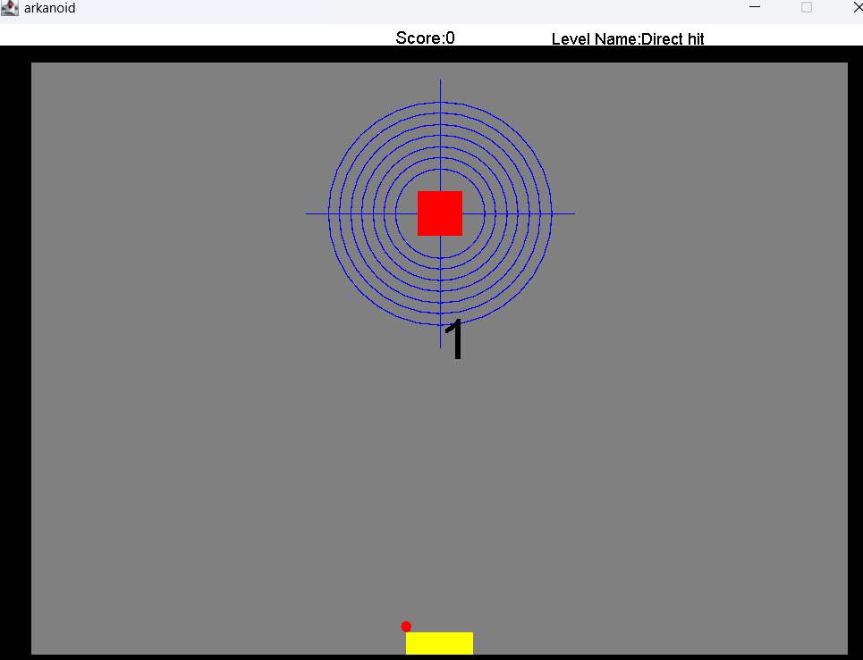
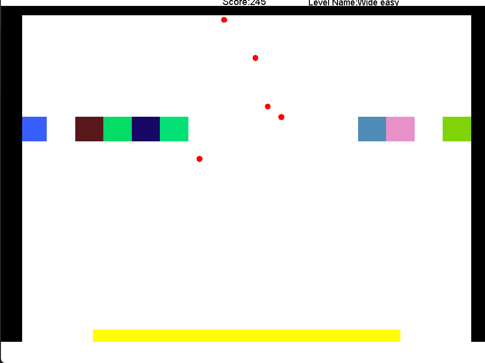
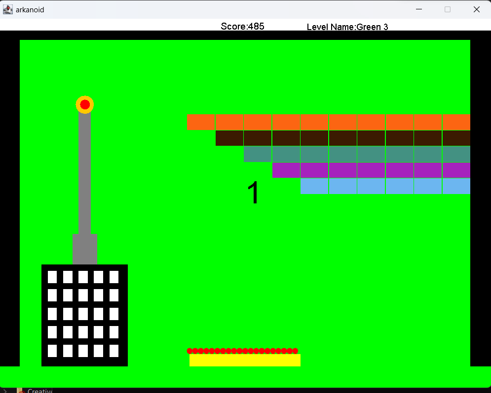
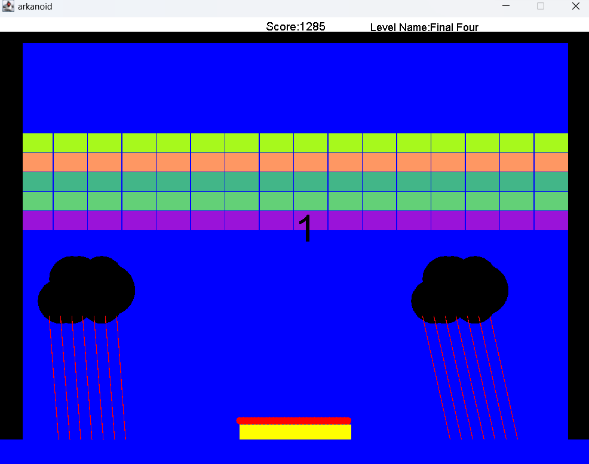

# Arkanoid Game in Java

## Overview
Arkanoid is a classic breakout-style game, developed using Java and various design patterns like Observer, Sprites, and Factory. Navigate through different levels, control a paddle to bounce the ball and break obstacles, and experience exciting and dynamic gameplay.

## Features
- **Multiple Levels:** Navigate through different intricately designed levels, each providing a unique challenge.
- **Controlled Paddle Movement:** Utilize the paddle effectively to guide the ball and break obstacles.
- **Pause & Play:** Have the freedom to pause the game and resume at your convenience.
- **Design Patterns:** Implemented using robust software design patterns like Observer, Sprites, and Factory.
- **Dynamic Gameplay:** Engaging graphics and dynamic gameplay provide a lively gaming experience.

## Screenshots

*Level 1*


*Level 2*


*Level 3*


*Level 4*


*Pause Screen*

## Controls
- **Movement:** Use `W` and `S` to move the paddle up and down respectively. Use `A` and `D` to move left and right.
- **Pause:** Press `P` to pause the game.
- **Resume:** After pausing, press `SPACE` to resume the game.

## How to Run
Ensure you have Apache Ant installed and configured in your system to compile and run the game.

### Steps
1. **Clone the Repository:**
    ```sh
    git clone https://github.com/safwan188/arkanoid.git
    ```
2. **Navigate to the Directory:**
    ```sh
    cd arkanoid
    ```
3. **Clean, Compile, and Run:**
    ```sh
    ant clean
    ant compile
    ant run
    ```

Enjoy playing the Arkanoid game!

## Notes
- Make sure to install and configure Apache Ant before running the game.
- Ensure Java is installed and configured in your system.

## Support
For any queries or support, please drop an issue in the GitHub repository.

## Contribute
Feel free to fork the project, submit a pull request, or suggest any additional features or enhancements.

---

**Happy Gaming!** 🎮🚀
